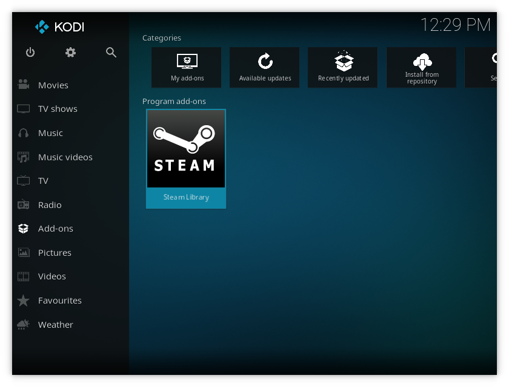
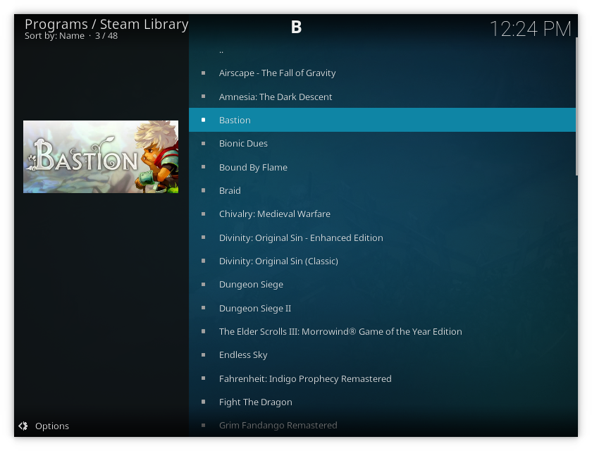

# kodi-steam-library-addon

With this addon you can view your entire Steam library right from Kodi.

This addon requires that you have a Steam account, have the Steam application installed, know your 17 digit Steam ID, and create a Steam API key.

To find your 17 digit Steam ID log into https://steamcommunity.com/, click on your username in the top right corner, and select view profile. Your 17 digit Steam ID will be in your web browsers address bar as the last 17 digits of the url.

To create a Steam API key log into https://steamcommunity.com/dev/apikey and create one. You could use "localhost" for the domain when prompted.

The following are Kodi dependencies for this addon:
- script.module.beautifulsoup4
- script.module.requests
- script.module.routing

If the following dependencies are not pulled in you might require them too:
- script.module.certifi
- script.module.chardet
- script.module.idna
- script.module.urllib3 

After you install this plugin go into the settings and enter your 17 digit Steam ID, your Steam API key, and select the path to your Steam executable if it is not correct. You may need to restart Kodi after you enter this information.

NOTE: Borrowed some images from these other great plugins:

- https://github.com/BrosMakingSoftware/Kodi-Launches-Steam-Addon/
- https://github.com/teeedubb/teeedubb-xbmc-repo/tree/master/script.steam.launcher
